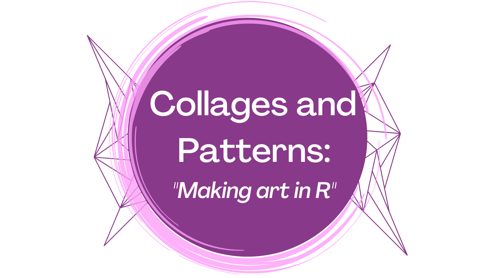

# Resources for “*Collages and Patterns: Making art in R”*

## About

This repository contains supplemental resources and materials that
coincide with the [*Collages and Patterns Rtistry
talk*](https://www.meetup.com/rladies-philly/events/288397735/)
presented on Wednesday, October 12th for the [R-Ladies
Philly](https://www.rladiesphilly.org/) Meetup Group. This presentation
aims to discuss the concept of creating generative art in R (Rtistry)
but then focus on a concept that seems to allude most: how to create the
data required for generative art.

## Presentation and Slides

The slides for this workshop can be viewed
[here](https://meghansaha.github.io/collages_and_patterns/).

The recorded presentation for this workshop can be viewed
[here](https://www.youtube.com/watch?v=hc7VaKRcrcY)

## Live Coding Example

 
You can view the code for the example (as pictured above) that was created live during this talk [here](https://github.com/Meghansaha/collages_and_patterns/blob/master/example_scripts/05_live_code.R).

## More Rtistry Resources

- Blog Post: [“Thinking Outside the Grid - A “bare bones” intro to
  Rtistry concepts in R using
  ggplot.”](https://www.thetidytrekker.com/post/thinking-outside-the-grid)

- Presentation Recording: [“Intro to Rtistry Using ggplot2 in
  R”](https://lnkd.in/gDcQTK5d)

- Presentation Slides: [“Intro to Rtistry Using ggplot2 in
  R”](https://lnkd.in/ghGDreS8)

- Example Code: [“Bars
  Example”](https://github.com/Meghansaha/Functions_in_Rtistry/blob/master/scripts/bars_example.R) -
  (An example on using Purrr functions for Rtistry)

- Rtistry Presentation Repository: “[Functions in
  Rtistry](https://github.com/Meghansaha/Functions_in_Rtistry)”

- “[Anatomy of Generative
  Art](https://github.com/Ijeamakaanyene/anatomy_of_generative_art)”
  Talk and Repository- [Ijemaka Anyene](https://ijeamaka.art/portfolio/)

- “[Art From Code](https://art-from-code.netlify.app/)” Workshop
  Materials - [Danielle Navarro](https://djnavarro.net/)
